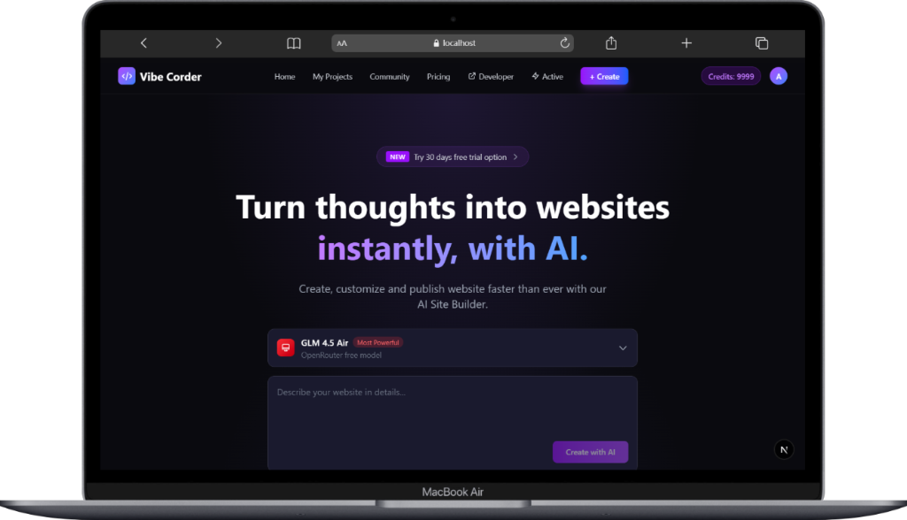
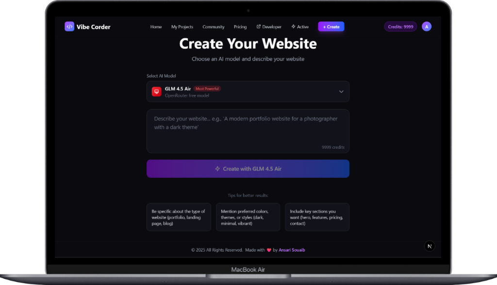
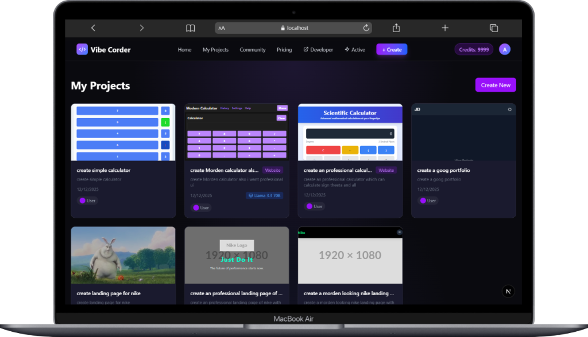
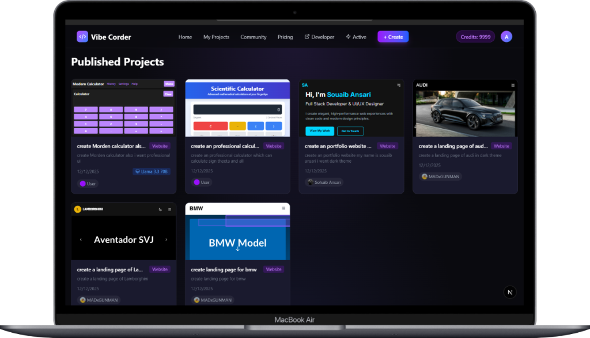

<p align="center">
  
  
  
  
  
</p>

<h1 align="center">
  
</h1>

<p align="center">
  
</p>

<p align="center">
  <a href="https://ansarisouaib.in">
    
  </a>
  <a href="LICENSE">
    
  </a>
  
</p>

---

## 🚀 About Vibe Corder

**Vibe Corder** is a powerful AI-powered website builder that transforms your ideas into fully functional websites in seconds. Simply describe what you want, select from a wide range of top-tier AI models, and watch as your website comes to life with real-time streaming code generation.

### ✨ Key Features

| Feature | Description |
|---------|-------------|
| 🤖 **Advanced AI Models** | **Gemini 2.5 Flash**, **Gent 2.0**, **Llama 3.3**, **GPT-4o**, and more |
| ⚡ **Real-time Streaming** | Watch your code generate live with streaming SSE |
| 🎨 **Visual Editor** | Click-to-edit elements with live preview and deep customization |
| 📱 **Responsive Design** | Preview in Desktop, Tablet, and Mobile views |
| 🌐 **One-Click Publish** | Share your creations with the community instantly |
| 💬 **Chat Revisions** | Refine your website through conversational AI |
| 📜 **Version History** | Track and restore previous versions of your build |
| 👑 **Admin Dashboard** | Unlimited credits and management for administrators |
| 🚀 **Active Generations** | Track your ongoing generation tasks |

---

## 📸 Screenshots

<p align="center">
  
  <br/>
  <em>🏠 Home Page - Create websites with AI</em>
</p>

<p align="center">
  
  <br/>
  <em>✨ Create Page - Describe your vision, choose an AI model</em>
</p>

<p align="center">
  
  <br/>
  <em>📁 My Projects - Manage all your creations</em>
</p>

<p align="center">
  
  <br/>
  <em>🌍 Community - Explore published projects</em>
</p>

---

## 🛠️ Tech Stack

### Frontend
| Technology | Version | Purpose |
|------------|---------|---------|
| **Next.js** | 16.0.10 | React framework with App Router |
| **React** | 19.2.1 | UI library |
| **TypeScript** | 5.x | Type safety |
| **Tailwind CSS** | 4.x | Styling |

### Backend & Database
| Technology | Purpose |
|------------|---------|
| **Firebase Auth** | User authentication (Google Sign-in) |
| **Cloud Firestore** | NoSQL database for projects, users, messages |
| **Next.js API Routes** | Server-side API endpoints |

### AI Integration
| Provider | Models |
|----------|--------|
| **Google DeepMind** | Gemini 2.5 Flash, Gemini 2.5 Flash Lite, Gemini 2.0 Flash, Gemini 2.0 Flash Lite |
| **OpenRouter** | GLM 4.5 Air, GPT OSS 120B, GPT OSS 20B |
| **Groq** | Llama 3.3 70B, Llama 3.1 8B |

### DevOps & Deployment
| Technology | Purpose |
|------------|---------|
| **Vercel** | Hosting & Deployment |
| **Firebase** | Backend services |

---

## 📂 Project Structure

```
vibe-corder/
├── 📁 src/
│   ├── 📁 app/                    # Next.js App Router
│   │   ├── 📄 page.tsx            # Home page
│   │   ├── 📄 layout.tsx          # Root layout
│   │   ├── 📄 globals.css         # Global styles
│   │   ├── 📁 api/                # API Routes
│   │   │   └── 📁 projects/
│   │   │       ├── 📁 stream/     # SSE streaming for generation
│   │   │       ├── 📁 revise-stream/  # SSE for revisions
│   │   │       ├── 📁 create/     # Project creation
│   │   │       ├── 📁 revise/     # Project revisions
│   │   │       └── 📁 publish/    # Publishing projects
│   │   ├── 📁 generate/           # Create new website page
│   │   ├── 📁 editor/[id]/        # Project editor & workspace
│   │   ├── 📁 preview/[id]/       # Project preview
│   │   ├── 📁 projects/           # My Projects page
│   │   ├── 📁 community/          # Published projects
│   │   ├── 📁 active/             # Active generations dashboard
│   │   ├── 📁 pricing/            # Pricing plans
│   │   └── 📁 login/              # Authentication
│   ├── 📁 components/             # React Components
│   │   ├── 📄 Header.tsx          # Navigation header
│   │   ├── 📄 Footer.tsx          # Site footer
│   │   ├── 📄 AuthProvider.tsx    # Auth context
│   │   └── 📄 ActiveGenerationsProvider.tsx
│   └── 📁 lib/                    # Utilities
│       ├── 📄 firebase.ts         # Firebase config
│       └── 📄 firestore.ts        # Database operations
├── 📁 screenshots/                # App screenshots
├── 📄 package.json                # Dependencies
├── 📄 tailwind.config.ts          # Tailwind config
├── 📄 tsconfig.json               # TypeScript config
├── 📄 next.config.ts              # Next.js config
└── 📄 README.md                   # This file
```

---

## ⚙️ Installation & Setup

### Prerequisites
- Node.js 18+ 
- npm or yarn
- Firebase account
- Google AI (Gemini) API key
- OpenRouter API key
- Groq API key

### 1. Clone the repository
```bash
git clone https://github.com/yourusername/vibe-corder.git
cd vibe-corder
```

### 2. Install dependencies
```bash
npm install
```

### 3. Configure environment variables
Create a `.env.local` file:
```env
# AI API Keys
GEMINI_API_KEY=your_gemini_key
OPENROUTER_API_KEY=your_openrouter_key
GROQ_API_KEY=your_groq_key

# Firebase Configuration
NEXT_PUBLIC_FIREBASE_API_KEY=your_api_key
NEXT_PUBLIC_FIREBASE_AUTH_DOMAIN=your_project.firebaseapp.com
NEXT_PUBLIC_FIREBASE_PROJECT_ID=your_project_id
NEXT_PUBLIC_FIREBASE_STORAGE_BUCKET=your_project.appspot.com
NEXT_PUBLIC_FIREBASE_MESSAGING_SENDER_ID=your_sender_id
NEXT_PUBLIC_FIREBASE_APP_ID=your_app_id

# App URL
NEXT_PUBLIC_APP_URL=http://localhost:3000

# Admin Credentials (Optional)
ADMIN_EMAIL=admin@example.com
ADMIN_PASSWORD=secure_password
```

### 4. Run the development server
```bash
npm run dev
```

Open [http://localhost:3000](http://localhost:3000) in your browser.

---

## 🎯 Features Deep Dive

### 🤖 AI-Powered Generation
- **Multi-Model Support**: Access state-of-the-art models like Gemini 2.5 Flash for superior code generation.
- **Smart Streaming**: Experience zero-latency code generation with direct SSE streams.
- **Context Awareness**: The AI understands your project structure and style preferences.

### 🎨 Visual Editor
- **Click-to-Edit**: Select any element to modify properties visually.
- **Color Pickers**: Intuitive color selection for background, text, and borders.
- **Live Preview**: See changes instantly as you type or click.
- **Responsive Testing**: Toggle between Desktop, Tablet, and Mobile views to ensure responsiveness.

### 💬 Chat Revisions
- **Conversational AI**: Describe changes naturally (e.g., "Make the header blue", "Add a contact form").
- **Code Streaming**: Watch the AI modify your code in real-time.
- **Rollback**: Easily revert to any previous version if you change your mind.

### 🌐 Publishing & Sharing
- **Instant Hosting**: Publish your site with one click.
- **Community Gallery**: Showcase your work and remix other users' projects.
- **Model Attribution**: Badges show which AI model power-lifted your project.

---

## 🔐 Security Features

- **Firebase Authentication**: Secure Google Sign-in integration.
- **Admin System**: Role-based access control with admin privileges.
- **Credit System**: Fair usage limits with admin bypass capabilities.
- **Secure API Routes**: Server-side validation and protection.

---

## 📊 Database Schema

### Users Collection
```typescript
interface User {
  id: string;
  email: string;
  name: string;
  imageUrl?: string;
  credits: number;
  totalCreation: number;
  isAdmin: boolean;
  createdAt: Timestamp;
}
```

### Projects Collection
```typescript
interface Project {
  id: string;
  name: string;
  initial_prompt: string;
  current_code: string;
  userId: string;
  isPublished: boolean;
  model?: string;
  createdAt: Timestamp;
  updatedAt: Timestamp;
}
```

---

## 🤝 Contributing

Contributions are welcome! Please feel free to submit a Pull Request.

1. Fork the project
2. Create your feature branch (`git checkout -b feature/AmazingFeature`)
3. Commit your changes (`git commit -m 'Add some AmazingFeature'`)
4. Push to the branch (`git push origin feature/AmazingFeature`)
5. Open a Pull Request

---

## 📄 License

This project is licensed under the MIT License - see the [LICENSE](LICENSE) file for details.

---

<h2 align="center">👨‍💻 Developer</h2>

<p align="center">
  
</p>

<p align="center">
  <a href="https://ansarisouaib.in">
    
  </a>
</p>

<p align="center">
  <b>Full Stack Developer & UI/UX Designer</b>
</p>

<p align="center">
  I create elegant, high-performance web experiences with clean code and modern design principles.
</p>

---

<p align="center">
  
</p>

<p align="center">
  ⭐ Star this repository if you found it helpful!
</p>
